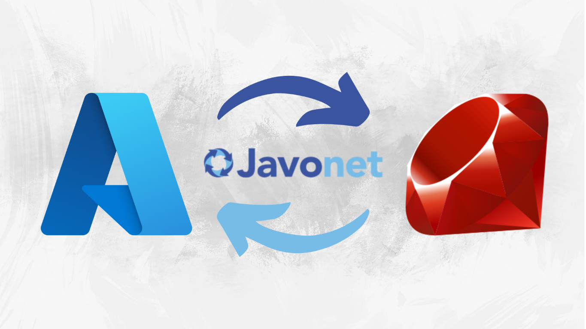

# 🧑‍💻 How to use Azure SDK with Unsupported Programming Languages? - Ruby

Microsoft Azure offers a robust set of tools and services, including its Software Development Kit (SDK) that simplifies the management of cloud resources. However, the Azure SDK is only officially supported in a few programming languages like C#, Python, and Java. For developers working in languages that don't have direct support (such as Ruby, Perl, or PHP), this can be a significant limitation. Let's go through the alternatives and enter Javonet - a runtime bridging technology that enables seamless integration of Python (and almost all languages) libraries, like Azure SDK, into non-supported languages like in this example - Ruby.

## 🤔 The Problem of SDK Support

Suppose you're building a cloud application in Ruby, and you need to interact with Azure’s cloud services, such as creating storage accounts or managing virtual machines. Since Azure SDK doesn’t provide a native Ruby implementation, you would normally need to develop custom API calls or switch to a supported language, which could slow down the development process and introduce additional complexity.

## 🌐 What are our options?

1. **Azure REST API Integration**

Azure provides comprehensive REST APIs that allow you to interact with most of its services, such as resource management, storage, virtual machines, and more. By using HTTP requests from Ruby (or any other language), you can send commands directly to Azure's services. You can check it here: https://learn.microsoft.com/en-us/rest/api/azure/

**Example with API:**
- Use Net::HTTP or libraries like Faraday: These Ruby libraries make it easy to send HTTP requests to Azure's endpoints
- Authentication: You need to authenticate using OAuth 2.0 tokens. You can use *Azure Active Directory (AAD)* - Now EntraID to get access tokens that allow you to securely interact with Azure services
- Construct API Calls: Use HTTP verbs (GET, POST, PUT, DELETE) to perform operations like creating VMs or managing storage
Example of using Azure REST API with Faraday:
```ruby
require 'faraday'
require 'json'

# Azure API endpoint
url = "https://management.azure.com/subscriptions/{subscription_id}/resourceGroups/{resource_group_name}/providers/Microsoft.Storage/storageAccounts/{storage_account_name}?api-version=2019-06-01"

# Azure token for authorization
token = "your_oauth_token"

# Create Faraday connection
conn = Faraday.new(url) do |f|
  f.request :json
  f.response :logger
  f.adapter Faraday.default_adapter
end

# Send a PUT request to create a new storage account
response = conn.put do |req|
  req.headers['Authorization'] = "Bearer #{token}"
  req.headers['Content-Type'] = 'application/json'
  req.body = {
    location: 'eastus',
    sku: { name: 'Standard_LRS' },
    kind: 'StorageV2',
    properties: {}
  }.to_json
end

puts "Response: #{response.status}, Body: #{response.body}"

```
---

2. **Azure CLI Automation**

Azure CLI is another versatile tool that allows you to manage Azure resources directly from your terminal. You can integrate Azure CLI commands within your Ruby scripts to automate interactions with Azure.

**Example with CLI:**
- Install Azure CLI: Ensure the Azure CLI is installed and authenticated on your machine
- Run CLI commands from Ruby: Use Ruby’s system method or backticks to run shell commands within your script

```Ruby
# Create a storage account using Azure CLI
resource_group = "myResourceGroup"
storage_account = "mystorageaccount"
location = "eastus"

system("az storage account create --name #{storage_account} --resource-group #{resource_group} --location #{location} --sku Standard_LRS")
```

---

3. **Third-Party Ruby Gems for Azure**

There are Ruby gems created by the community for working with Azure services. While these may not cover the full range of Azure SDK features, they can simplify common tasks like managing storage or virtual machines. Unfortunately, they can be archived or no longer supported as a lot of community gems.

It is just example how it worked so You can feel it.

**Example:**
- azure_mgmt_resources: This gem provides a client library for managing Azure resources.
- azure-storage-common: This gem is used to manage Azure Blob Storage, Table Storage, and other data services.

```Ruby
gem install azure_mgmt_resources
gem install azure-storage-blob
```

```Ruby
require 'azure_mgmt_resources'
require 'azure/storage/blob'

# Example: List resource groups
client = Azure::Resources::Profiles::Latest::Mgmt::Client.new
client.resource_groups.list.each do |group|
  puts group.name
end
```
---

4. **Javonet?**

**What if you have specific Python libraries you need to use in Ruby, but don't want to rebuild API calls from scratch?**


In cases where you rely on existing Python Azure SDKs or other Python libraries and need to avoid complex REST API integration or rebuilding entire service layers, Javonet becomes a top choice. It allows seamless access to Python libraries directly from Ruby (or other unsupported languages) without the need for complex rewrites, ensuring faster development and full compatibility with the Python ecosystem.
## 🛠️ How Javonet Helps?

Javonet bridges the gap between different programming languages by allowing you to call methods, instantiate objects, and interact with classes from a different language—directly from your codebase. This means you can easily use the Azure SDK for Python in Ruby, or other unsupported languages without creating extra service layers or switching programming environments.

## </> Code Example: Using Azure SDK in Ruby via Javonet
Here’s a practical example showing how Javonet can be used to access Azure SDK for Python from Ruby to create a resource groups in Azure.


First, we are going to analyze what we are going to cook. We will need an environment, then install all necessary tools. Next, we need to decide what we are going to do (in my example, creating a Resource Group in Azure as a simple demo of possibilities) and then figure out how to do it. We will use the Azure SDK for Python, so we should understand how it works. 

**!!! In my example, I totally skip the Azure authentication part. This can be done in various ways, depending on your needs. Here, the simplest way is to use the CLI—only for demo purposes. If you are using it in an application, consider using Managed Identity :)**


```bash
# install Azure CLI
curl -sL https://aka.ms/InstallAzureCLIDeb | sudo bash
```

- https://learn.microsoft.com/en-us/cli/azure/install-azure-cli-linux

```bash
# auth into Azure with web browser
az login
```

So to do it in Python with Azure SDK for Python we will need 2 modules from Azure SDK: azure-identity to authenticate and azure-mgmt-resource to create Resource Group.
```python
# import modules (after installing them with pip)
from azure.identity import DefaultAzureCredential
from azure.mgmt.resource import ResourceManagementClient

# authenticate using the default Azure credentials
credential = DefaultAzureCredential()

# set you sub id
subscription_id = "your-subscription-id"

# create instance of ResourceManagementClient
resource_client = ResourceManagementClient(credential, subscription_id)

# create Resource Group
resource_client.resource_groups.create_or_update(
        'resourcegroupname123',  # Resource group name
        {'location': 'northeurope'} # Location
)
```
- https://learn.microsoft.com/en-us/python/api/azure-identity/azure.identity.defaultazurecredential?view=azure-python
- https://learn.microsoft.com/en-us/python/api/azure-mgmt-resource/azure.mgmt.resource.resources.resourcemanagementclient?view=azure-python
- https://learn.microsoft.com/en-us/azure/developer/python/sdk/examples/azure-sdk-example-resource-group?tabs=cmd
- https://learn.microsoft.com/en-us/python/api/azure-mgmt-resource/azure.mgmt.resource.resources.v2022_09_01.operations.resourcegroupsoperations?view=azure-python#azure-mgmt-resource-resources-v2022-09-01-operations-resourcegroupsoperations-create-or-update
- https://learn.microsoft.com/en-us/python/api/azure-mgmt-resource/azure.mgmt.resource.resources.v2022_09_01.models.resourcegroup?view=azure-python

Remember to always check docs and what you are using :) in these example **DefaultAzureCredential()** takes no arguments and **ResourceManagementClient()** needs 2 arguments.

Next **resource_groups.create_or_update()** form **ResourceManagementClient** need 2 arguments. First **name** which is string and then **parameters** as **dictionary** in which we have to provide location of our Resource Group.

And that is it, you can now simply create RG with Python - Let's do it in Ruby!

---

0. **Prerequisites**

Since we are working with Javonet, Azure, and Python, we need to take a few things into account (for this example, I have used GitHub Codespaces as my environment):
- Open fresh new GitHub Codespaces
- Install Azure CLI and log into Azure
- Install Ruby
- Install Python (watch out for a lot of pythons in your enviroment)
- Install nessesary Python Modules for you Python
- Install Javonet to Ruby (command down there)
- Get your free trial key (3 mins of work) form Javonet.com

And lets do it!

1. **Install Javonet**
First, you need to install Javonet in your Ruby environment using the following command
```ruby
gem install javonet-ruby-sdk
```

2.  **Python**
Install necessary Python Modules:
```bash
# sometime it is tricky to install modules in correct python, if you have problems with those modules try which -a python/python3/python38 etc commands to find correct one and install you modules there using full path to it
# you can verify it with pip list command
which python

# in my case this Python
/home/codespace/.python/current/bin/python -m pip install azure-identity
/home/codespace/.python/current/bin/python -m pip install azure-mgmt-resource
```


2. **Initialize Javonet and Load Python**
After installation, initialize Javonet and load the required Python environment

Don't be intimidated by this complex syntax; it's our Javonet. After understanding the concept and learning a few commands, it becomes very easy.
```ruby
require 'javonet-ruby-sdk'

# use activate only once in your app (javonet.com for free trial)
Javonet.activate("your-license-key")

# create called runtime context
called_runtime = Javonet.in_memory.python

# load library
called_runtime.load_library("your-path")
#called_runtime.load_library(".")

# set up variables
subscription_id = "yor-subscription-id"

# now load those modules using Javonet
azure_identity = called_runtime.get_type("azure.identity.DefaultAzureCredential").execute
azure_mgmt_resource = called_runtime.get_type("azure.mgmt.resource.ResourceManagementClient").execute

# execute DefaultAzureCredential & ResourceManagementClient
credential = azure_identity.create_instance().execute
ResourceManagementClient_type = azure_mgmt_resource.create_instance(credential, subscription_id).execute

# now is the tricky part. Do you remember that our python method 'create_or_update' takes 2 arguments? - name and dictionary. For name it is easy job but for dictioary we can do it in a bunch of ways. We need {'location': 'northeurope'}.

# we can do it with some other Python builtins methods like split, zip and dict :)
zip = called_runtime.get_type("builtins").invoke_instance_method("zip", ["location"], ["northeurope"]).execute
dict = called_runtime.get_type("builtins").invoke_instance_method("dict",zip).execute
prints = called_runtime.get_type("builtins").invoke_instance_method("print", dict).execute.get_value

# and our final is Python {'location': 'northeurope'} in Ruby "dict" variable

```
- https://www.javonet.com/
- https://www.javonet.com/guides/v2/

3. **Create Resource Group in Azure Subscription**


```ruby
# now just simply get it all together and we are done :) Resource Group created!
create_rg = ResourceManagementClient_type.get_instance_field("resource_groups").invoke_instance_method("create_or_update", "resourcegroupname123", dict).execute
```

4. **Problems** 

In my example i ran into python problem:
```bash
/usr/lib/python3.8/importlib/__init__.py:127 in '__init__#import_module'
<frozen importlib._bootstrap>:1014 in '<frozen importlib#_gcd_import'
<frozen importlib._bootstrap>:991 in '<frozen importlib#_find_and_load'
<frozen importlib._bootstrap>:961 in '<frozen importlib#_find_and_load_unlocked'
<frozen importlib._bootstrap>:219 in '<frozen importlib#_call_with_frames_removed'
<frozen importlib._bootstrap>:1014 in '<frozen importlib#_gcd_import'
<frozen importlib._bootstrap>:991 in '<frozen importlib#_find_and_load'
<frozen importlib._bootstrap>:973 in '<frozen importlib#_find_and_load_unlocked'
: Exception No module named 'azure' (Exception)
```
in that case we installed our python modules in wrong python interpreter/version :) 
```bash
which -a python

# it given me some more Python installed in my env.
/home/codespace/.python/current/bin/python
/usr/local/python/current/bin/python
/opt/conda/bin/python

which -a python3

# even more pythons!
/home/codespace/.python/current/bin/python3
/usr/local/python/current/bin/python3
/opt/conda/bin/python3
/usr/bin/python3
/bin/python3

# our error give us a hint in the first line
line /usr/lib/python3.8/importlib/__init__.py:127 in '__init__#import_module'

# so lets install modules there 
/usr/bin/python3 -m pip install azure-identity
/usr/bin/python3 -m pip install azure-mgmt-resource

# and now our code works! RG created! - check it in your env or try to print it with python IN RUBY with Javonet!
```

In this example, we load the Azure SDK for Python, instantiate an Azure Management client, and created Resource Group — all from Ruby code, thanks to Javonet. The Ruby application now has full access to Azure services through Python libraries, with no need to change the development language.

You can also use Javonet to many other usecases like PyJokes in Ruby as simple as this :D

```bash
/usr/bin/python3 -m pip install pyjokes
```
```ruby
joke = called_runtime.get_type('pyjokes.get_joke').execute
joke_type = joke.create_instance().execute
result = joke_type.get_value
puts "pyjokes: " + result

# pyjokes: What does pyjokes have in common with Adobe Flash? It gets updated all the time, but never gets any better.
```


## 🌟 Benefits of Using Javonet
- **Time Savings:** Javonet eliminates the need to create custom API layers for unsupported languages, reducing the time spent on developing integrations.
- **Performance:** Since Javonet executes code directly in memory, it offers performance comparable to native SDK use.
- **Cross-Platform:** Javonet works across Windows, Linux, and Mac, providing flexibility for multi-platform deployments.
- **Code Reusability**: Developers can reuse existing Python codebases in different programming environments, making the process more efficient and consistent.

## ✅ Conclusion
In the rapidly evolving world of cloud computing, the ability to integrate across different technologies is crucial. Now Javonet enables developers working in languages without native Azure SDK support to fully utilize Azure’s cloud services. By using Javonet, developers can maintain their preferred programming languages while still leveraging the power of Azure SDK, streamlining their workflows and improving productivity.

This cross-language compatibility allows for faster development cycles and more flexible architecture choices, making Javonet a key tool for modern, cloud-based application development.

## 📚 More Resources and Steps

Learn More About Javonet and Azure SDK:
- [Official Javonet Guides](https://www.javonet.com/)
- [Azure SDK for Python Overview: Azure SDK for Python](https://learn.microsoft.com/en-us/azure/developer/python/sdk/azure-sdk-overview)
- [How to Use Azure SDK in Python: Azure SDK for Python](https://learn.microsoft.com/en-gb/azure/developer/python/)

By following these resources, you can deepen your understanding of how to integrate Azure SDK with unsupported programming languages using Javonet and expand your capabilities in cloud application development.
